# Programming Quiz Application Expansion Plan

## 1. Overall Architecture

We'll maintain the current application structure but expand it to include new languages:

```mermaid
graph TD
    A[Quiz Application] --> B[C++ Modules]
    A --> C[Python Modules]
    A --> D[JavaScript Modules]
    A --> E[Web Development Modules]
    A --> F[Java Modules]
    
    B --> B1[Existing C++ Modules]
    
    C --> C1[Python Basics]
    C --> C2[Data Structures]
    C --> C3[File I/O]
    C --> C4[Data Analysis with Pandas]
    C --> C5[Web Scraping]
    
    D --> D1[JavaScript Basics]
    D --> D2[DOM Manipulation]
    D --> D3[Async Programming]
    D --> D4[Frontend Frameworks]
    D --> D5[APIs]
    
    E --> E1[HTML Basics]
    E --> E2[CSS Styling]
    E --> E3[Responsive Design]
    E --> E4[JavaScript Integration]
    E --> E5[Web APIs]
    
    F --> F1[Java Basics]
    F --> F2[OOP Concepts]
    F --> F3[Collections Framework]
    F --> F4[Multithreading]
    F --> F5[GUI with JavaFX]
```



## 2. File Structure Updates

We'll need to expand the current file structure to accommodate the new modules:

```
.
├── app.py                  # Updated Flask application
├── requirements.txt        # Updated Python dependencies
├── data/                   # Expanded JSON data files
│   ├── cpp/                # C++ modules (existing files moved here)
│   │   ├── basics.json
│   │   ├── conditionals.json
│   │   ├── functions.json
│   │   ├── loops.json
│   │   └── arrays.json
│   ├── python/             # Python modules
│   │   ├── basics.json
│   │   ├── data_structures.json
│   │   ├── file_io.json
│   │   ├── pandas.json
│   │   └── web_scraping.json
│   ├── javascript/         # JavaScript modules
│   │   ├── basics.json
│   │   ├── dom.json
│   │   ├── async.json
│   │   ├── frameworks.json
│   │   └── apis.json
│   ├── web/                # Web Development modules
│   │   ├── html.json
│   │   ├── css.json
│   │   ├── responsive.json
│   │   ├── js_integration.json
│   │   └── web_apis.json
│   └── java/               # Java modules
│       ├── basics.json
│       ├── oop.json
│       ├── collections.json
│       ├── multithreading.json
│       └── javafx.json
├── static/                 # Static assets
│   ├── css/
│   │   └── styles.css      # Updated styles
│   └── js/
│       └── script.js       # Updated script
└── templates/              # Expanded HTML templates
    ├── index.html          # Updated home page
    ├── cpp/                # C++ module templates
    │   ├── basics_module.html
    │   ├── conditionals_module.html
    │   ├── loops_module.html
    │   ├── functions_module.html
    │   └── arrays_module.html
    ├── python/             # Python module templates
    │   ├── basics_module.html
    │   ├── data_structures_module.html
    │   ├── file_io_module.html
    │   ├── pandas_module.html
    │   └── web_scraping_module.html
    ├── javascript/         # JavaScript module templates
    │   ├── basics_module.html
    │   ├── dom_module.html
    │   ├── async_module.html
    │   ├── frameworks_module.html
    │   └── apis_module.html
    ├── web/                # Web Development module templates
    │   ├── html_module.html
    │   ├── css_module.html
    │   ├── responsive_module.html
    │   ├── js_integration_module.html
    │   └── web_apis_module.html
    └── java/               # Java module templates
        ├── basics_module.html
        ├── oop_module.html
        ├── collections_module.html
        ├── multithreading_module.html
        └── javafx_module.html
```

## 3. Backend Updates (app.py)

We'll need to update the Flask application to handle the new modules:

```python
from flask import Flask, render_template, jsonify, send_from_directory, redirect, url_for
import os

app = Flask(__name__)

# Serve the main page
@app.route('/')
def index():
    return render_template('index.html')

# Serve teaching module pages
@app.route('/learn/<language>/<module>')
def learn_module(language, module):
    template_path = f"{language}/{module}_module.html"
    if os.path.exists(os.path.join('templates', template_path)):
        return render_template(template_path)
    else:
        return redirect(url_for('index'))

# Serve quiz module pages
@app.route('/quiz/<language>/<module>')
def quiz_module(language, module):
    if os.path.exists(os.path.join('data', language, f"{module}.json")):
        return render_template('index.html')
    else:
        return redirect(url_for('index'))

# Serve JSON data files
@app.route('/data/<language>/<filename>')
def serve_json(language, filename):
    return send_from_directory(f'data/{language}', filename)

if __name__ == '__main__':
    app.run(debug=True)
```

## 4. Frontend Updates (index.html)

The home page will need to be updated to include sections for each language:

```html
<!DOCTYPE html>
<html lang="en">
<head>
    <meta charset="UTF-8">
    <meta name="viewport" content="width=device-width, initial-scale=1.0">
    <title>Programming Quiz</title>
    <!-- DaisyUI and Tailwind CSS -->
    <link href="https://cdn.jsdelivr.net/npm/daisyui@3.9.4/dist/full.css" rel="stylesheet" type="text/css" />
    <script src="https://cdn.tailwindcss.com"></script>
    <!-- Custom CSS -->
    <link rel="stylesheet" href="{{ url_for('static', filename='css/styles.css') }}">
</head>
<body class="bg-gray-100 min-h-screen">
    <div class="container mx-auto px-4 py-8">
        <div class="card bg-base-100 shadow-xl max-w-5xl mx-auto">
            <div class="card-body">
                <h1 class="card-title text-3xl font-bold text-center mb-6">Programming Quiz</h1>
                
                <!-- Home Screen -->
                <div id="home-screen">
                    <p class="text-center mb-6">Test your knowledge with these interactive programming quizzes!</p>
                    
                    <!-- Language Tabs -->
                    <div class="tabs tabs-boxed mb-6">
                        <a class="tab tab-active" onclick="showLanguage('cpp')">C++</a>
                        <a class="tab" onclick="showLanguage('python')">Python</a>
                        <a class="tab" onclick="showLanguage('javascript')">JavaScript</a>
                        <a class="tab" onclick="showLanguage('web')">Web Dev</a>
                        <a class="tab" onclick="showLanguage('java')">Java</a>
                    </div>
                    
                    <!-- C++ Modules -->
                    <div id="cpp-modules" class="language-modules">
                        <!-- Existing C++ module cards -->
                    </div>
                    
                    <!-- Python Modules -->
                    <div id="python-modules" class="language-modules hidden">
                        <!-- Python module cards -->
                    </div>
                    
                    <!-- JavaScript Modules -->
                    <div id="javascript-modules" class="language-modules hidden">
                        <!-- JavaScript module cards -->
                    </div>
                    
                    <!-- Web Development Modules -->
                    <div id="web-modules" class="language-modules hidden">
                        <!-- Web Development module cards -->
                    </div>
                    
                    <!-- Java Modules -->
                    <div id="java-modules" class="language-modules hidden">
                        <!-- Java module cards -->
                    </div>
                </div>
                
                <!-- Rest of the existing content (Topic Start Screen, Quiz Container, Results Screen) -->
            </div>
        </div>
    </div>
    
    <script src="{{ url_for('static', filename='js/script.js') }}"></script>
</body>
</html>
```

## 5. JavaScript Updates (script.js)

The JavaScript file will need to be updated to handle the new language modules:

```javascript
document.addEventListener('DOMContentLoaded', function() {
    // Quiz questions organized by language and topic
    let quizData = {
        cpp: {},
        python: {},
        javascript: {},
        web: {},
        java: {}
    };
    
    // Load quiz data from JSON files
    async function loadQuizData() {
        try {
            // Define the languages and topics to load
            const languages = {
                cpp: ['basics', 'conditionals', 'loops', 'functions', 'arrays'],
                python: ['basics', 'data_structures', 'file_io', 'pandas', 'web_scraping'],
                javascript: ['basics', 'dom', 'async', 'frameworks', 'apis'],
                web: ['html', 'css', 'responsive', 'js_integration', 'web_apis'],
                java: ['basics', 'oop', 'collections', 'multithreading', 'javafx']
            };
            
            // Load each language's topics
            const promises = [];
            
            for (const [language, topics] of Object.entries(languages)) {
                for (const topic of topics) {
                    promises.push(
                        fetch(`/data/${language}/${topic}.json`)
                            .then(response => {
                                if (!response.ok) {
                                    throw new Error(`Failed to load ${language}/${topic}.json`);
                                }
                                return response.json();
                            })
                            .then(data => {
                                quizData[language][topic] = data;
                            })
                            .catch(error => {
                                console.error(`Error loading ${language}/${topic}.json:`, error);
                            })
                    );
                }
            }
            
            // Wait for all data to be loaded
            await Promise.all(promises);
            console.log('All quiz data loaded successfully');
            
            // Initialize the quiz after data is loaded
            initializeQuiz();
        } catch (error) {
            console.error('Error loading quiz data:', error);
            alert('Failed to load quiz data. Please refresh the page and try again.');
        }
    }
    
    // Start loading the quiz data
    loadQuizData();
    
    // Function to show a specific language's modules
    function showLanguage(language) {
        // Hide all language modules
        document.querySelectorAll('.language-modules').forEach(el => {
            el.classList.add('hidden');
        });
        
        // Show the selected language's modules
        document.getElementById(`${language}-modules`).classList.remove('hidden');
        
        // Update active tab
        document.querySelectorAll('.tab').forEach(tab => {
            tab.classList.remove('tab-active');
        });
        document.querySelector(`.tab[onclick="showLanguage('${language}')"]`).classList.add('tab-active');
    }
    
    // Make the showLanguage function globally available
    window.showLanguage = showLanguage;
    
    // Rest of the existing JavaScript code with updates to handle the new structure
    // ...
});
```

## 6. Implementation Steps

1. **Restructure the existing files**:
   - Create the new directory structure
   - Move existing C++ files to the cpp subdirectory

2. **Update the backend**:
   - Modify app.py to handle the new language-based routing

3. **Update the frontend**:
   - Update index.html to include language tabs
   - Update script.js to handle multiple languages

4. **Create module templates**:
   - Create HTML templates for each module
   - Follow the existing template structure but customize for each language

5. **Create JSON data files**:
   - Create JSON files for each module with questions and answers

6. **Testing**:
   - Test the application with each language
   - Ensure proper navigation between modules
   - Verify quiz functionality for all languages